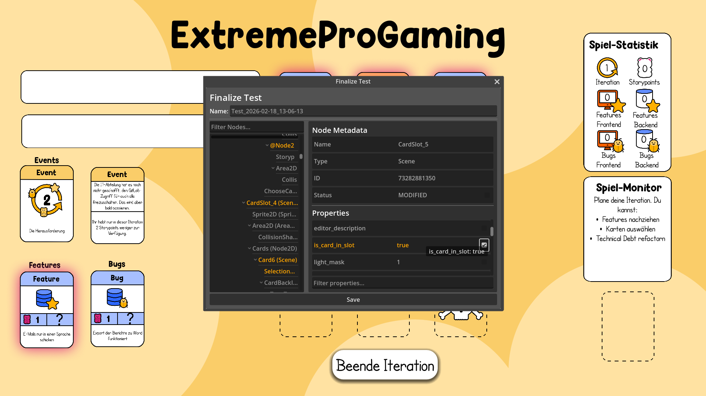
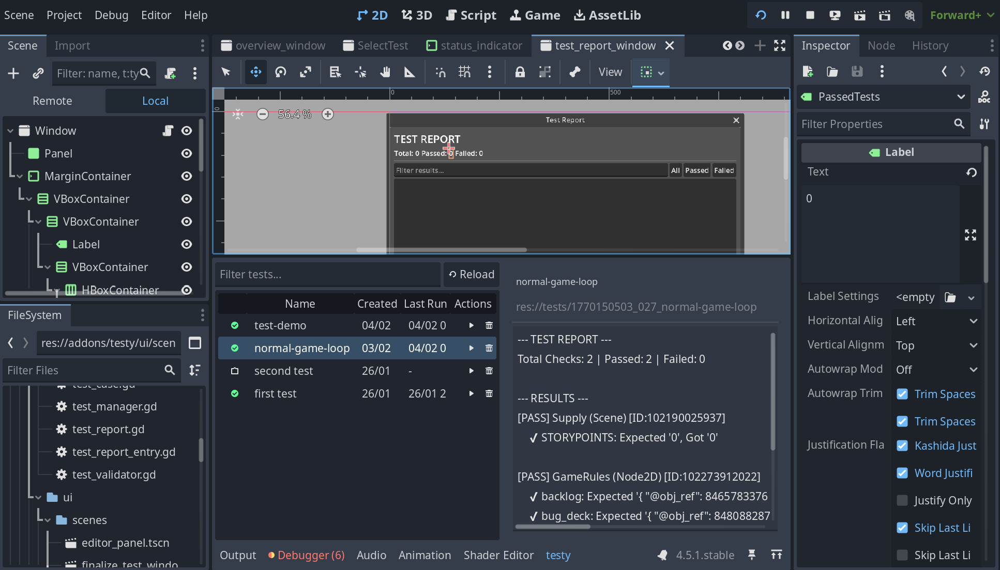
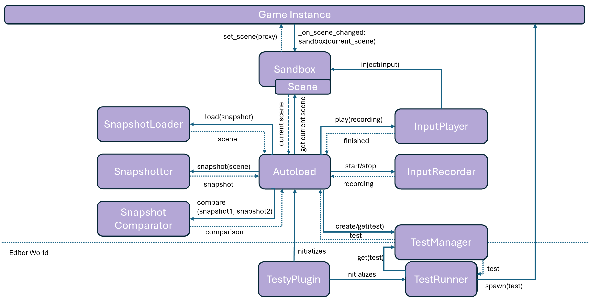

# Testy: Godot Interactive Testing

**Testy** is a Godot addon that allows developers to record game loops to create automated integration tests. Unlike standard unit testing tools, Testy focuses on the actual game loop, enabling recording, serialization of game states, playback and assertions.

## Quickstart
1. Clone the repository into the `addons/` directory of your Godot project
2. Enable the plugin in the Godot settings **Project > Project Settings > Plugins**
3. To use it: Press **CTRL+R** while the game is running to start and stop a recording, or use the "Test Runner" panel in the editor at the bottom

## Abstract
Testy is a Godot addon designed to enable gameloop testing. It allows developers to record user interactions within the game loop and replay them at any time. The tool combines input recording, game-state serialization, test playback, and assertions into a test workflow.

Automated testing in GOdot is currently often complex and primarily focused on code-level unit tests. Testy addresses this gap by enabling automated testing of the game loop itself. This task is normally performed manually.

With Testy, users can record a gameplay session as a test: all mouse and keyboard inputs are captured, and the game state is serialized. After the recording, Testy computes the differences between the recorded states. Then the users can select which parameters should be used as test criteria. The tests can then be executed inside the running game or from the Godot editor. The game is simulated, and the inputs are injected. After each execution, Testy verifies whether the defined criteria are fulfilled.

The motivation for Testy is to enable interactive gameplay tests while keeping the plugin architecture decoupled from the game code. It is designed to be usable without prior programming experience.

## How to Use Testy

The tool offers two main interaction modes: **In-Game Recording and Playback** and **Editor Playback**.

### 1. Recording a Test (In-Game)

1. Run your game instance
2. Press **CTRL+R** to open the start recording window
3. Perform the gameplay that you want to test
4. Press **CTRL+R** again to stop the test recording
5. The window at the top will open, showing the added, removed and changed objects between the gamestates
6. Select the parameters you want to add to your **Test Criteria** (Assertions)
7. Save the test with a test name
8. You can verify the test immediately by pressing **CTRL+R** again and selecting the test

### 2. Running Tests (Editor)

You can run existing tests directly from the Godot Editor

1. Open the **Testy** panel at the bottom of the editor (see image at the top)
2. Click on the test that should be executed
3. View the results directly in the panel

## Games
This tool is currently used and tested with **Godot 4.5** in:
- [Extreme Pro Gaming Fame](https://github.com/hpi-swa-lab/ExtremeProGaming-Godot)
- [Babylonian Programming](https://github.com/hpi-swa-lab/babylonian-programming-godot/tree/eud25)

## Known Issues
**Input Interference:**
Currently, it is not possible to fully encapsulate keyboard input during test playback. If the test window is focused during playback, your manual keyboard interactions might interfere with the test. But normally you would not focus this window, so there should not be a problem.

**Input Recording Limitation:**
Testy records input by overriding `_input` and storing events together with the current tick. Limitation: If the game also overrides `_input` and consumes events (marks them as handled), there is no reliable way for the recorder to capture these events.

**Snapshot Limitation:**
Testy’s Snapshotter cannot reliably restore anonymous functions (lambdas) and async timers. It also cannot handle changes to the initial scene (added/removed nodes). Only changes in later scenes and code are supported.

## Architecture

## Game Architecture Overview

- **Game Instance:**
This is the actual running game instance, it only interacts with the Testy Plugin.
- **TestyPlugin:**
The entry point. Loads the Autoload and establishes the connection to the game.
- **Autoload:**
Manages all classes. Loaded by the plugin manager, it listens to global input and sends it to relevant classes.
- **Sandbox:**
Encapsulates the Scene and communicates with the Game Instance. For playback, it simulates an encapsulated scene.
- **Snapshot:**
    - **Snapshotter:**
    Serializes the current game state by traversing the root node and converting it into a storable format.
    - **SnapshotLoader:**
    Loads serialized game states for test playback, clearing currently available objects.
    - **Snapshot Comparator:**
    Compares two serialized game states to calculate the differnces (nodes added, removed, or parameters changed).
- **Input:**
    - **InputRecorder:**
    Listens to user input and saves it to a file along with the current game tick.
    - **InputPlayer:**
    Injects recorded inputs back into the Sandbox during playback.
- **TestManager:**
Manages test execution, file saving, and success status.
- **TestRunner:**
The interactive user interface within the Godot code editor for running multiple tests.

## Data architecture
Recorded tests are saved in the `tests` folder. Each test consists of the following files:

| Filename | Description |
| :--- | :--- |
| `test_case.tres` | Basic info: test name, creation date, seed, last successful execution. |
| `snapshot_a.tres` | Game state at the **start** of the recording. |
| `snapshot_b.tres` | Game state at the **end** of the recording. |
| `input_recording.tres` | Recorded input events (Event type, Ticks). |
| `assertions.testy` | The selected test criteria (what defines success). |
| `test_report.tres` | Output/Result from the last test run. |